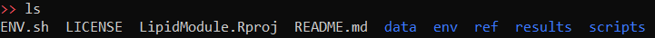

# LipidModule

RNAseq-based detection of genes related to macrophage lipid accumulation relevant to CNS injury.

## How to Run on Pegasus

Majority of this was run on University of Miami's Pegasus cluster. Has only been tested on Ubuntu.

### Initial Setup and Installing Packages

1. Login to Pegasus using your CCS account credentials. I use WSL2 (Windows Subsystem for Linux 2) to create a Ubuntu virtual environment on my Windows machine to SSH directly. If you don't have this setup, you can use PuTTy. Carefully read through [IDSC's documentation](https://acs-docs.readthedocs.io/services/1-access.html#ssh) for instructions on connecting via SSH. Also carefully read through [IDSC's policies](https://acs-docs.readthedocs.io/policies/policies.html#policies) for usage terms and conditions. If you are logging in for the first time, contact IDSC (or James, jsc228 at miami dot edu).

1. Once connected, you will see the following:
    
    
    Since the analysis involves downloading sequencing data, which can be fairly large, we need to use the `scratch` space on Pegasus. Read [the docs](https://acs-docs.readthedocs.io/pegasus/env/1-intro.html#pegasus-filesystems) for more info.

1. Make a new project directory. I named mine LipidModule. This makes a new folder in your `nethome`. Then `cd` into it.
    ```
    mkdir LipidModule
    cd LipidModule
    ```
1. Clone this Github repository to download the necessary scripts and folder structure. Change file permissions with `chmod` to make `.sh` files executable. Note the trailing "." in the first command.
    ```
    # TODO: CHANGE THIS TO LEE LAB ACCOUNT REPO
    # Maybe run `chmod 755 *.sh` instead of below(?)
    git clone https://github.com/JamesChoi94/LipidModule.git .
    chmod -R -x *
    chmod -R +x *.sh
    ```
    If you run `ls`, you should now see some contents preloaded into your new project folder like so:

    
1. Export `nethome` and `scratch` directory locations. Double-check `$HOME` directory.
    ```
    export NETHOME=/nethome/jsc228/LipidModule
    export SCRATCH=/scratch/projects/lemmon/jsc228/LipidModule
    echo $HOME
    ```
    Your `$HOME` directory should be above your project directory e.g. `/nethome/jsc228/`. This is where Miniconda3 will be installed.
1. Run the following to install Miniconda3, the sra-toolkit, and set up environment variables that will be required for downstream tools. Specific packages are laid out in `config/LipidModule.yml`. 
    ```
    source setup_environment.sh
    ```
1. Verify successful installation of conda and its the RNAseq preprocessing environment.
    ```
    conda list --name LipidModule
    ```


### RNA-seq processing

1. Before you begin, create a tab-delimited (.tsv) sample spreadsheet of study GSM accessions from which you wish to pull. See [sample spreadsheet](data/samples_sheet.tsv) for an example. _Note_: First column, which contains the GSM accession codes, is __required__. I recommend having study titles in the second column. All other columns are not required. Save this file somewhere on your local machine (i.e. your own computer). You can obtain GSM acceessions by searchin individual studies using their GEO accessions.

1. Get SRR accession associated for the GSM accessions in the sample sheet.
    ```
    # After conda activate LipidModule
    source bin/Geo2Sra.sh -s data/samplesheet.csv
    ```
1.


1. Create a file named `configure_directories.sh` with commands to set your `nethome` and `scratch` directory locations. 
    ```
    echo "export NETHOME=/nethome/jsc228/LipidModule" >> configure_directories.sh
    echo "export SCRATCH=/scratch/projects/lemmon/jsc228/LipidModule" >> configure_directories.sh
    ```


Run the following to change your working directory to your designated folder in `scratch`.
    ``` 
    cd /scratch/projects/lemmon/jsc228/
    ```

1. Install necessary packages and software (e.g. conda, R, etc.)
    ```
    bash scripts/setup_linux_environment.sh
    ```
1. Setup environment variables.
    ```
    source ENV.sh
    ```   
1. Query NCBI.
    ```
    R scripts/query_gsm2sra.r
    ```
1.
