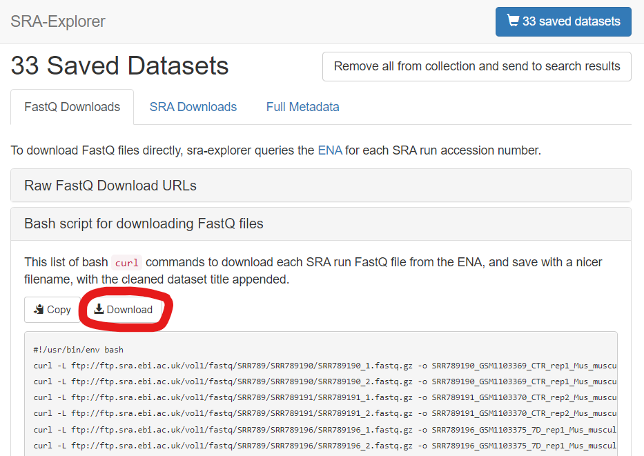
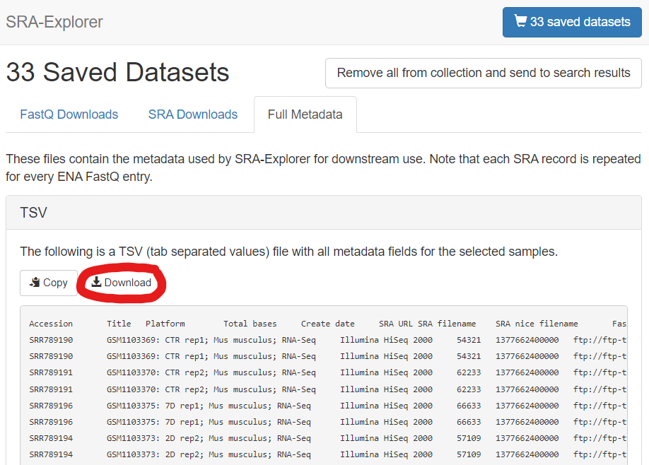
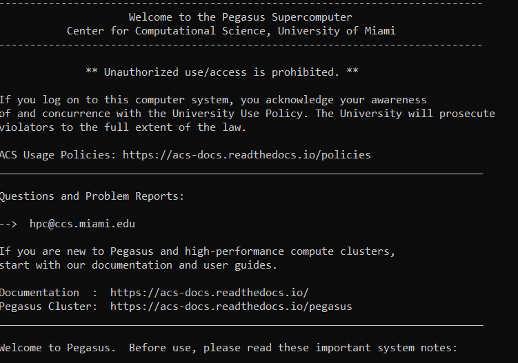

# LipidModule

RNAseq-based detection of genes related to macrophage lipid accumulation relevant to CNS injury.

## How to Run on Pegasus

Majority of this was run on University of Miami's Pegasus cluster. Has only been tested on Ubuntu.

### Initial Setup and Installing Packages

1. Create a local copy of this repository on your computer. The easiest way is to use a command line terminal such as [Git Bash](https://git-scm.com/downloads). Enter into command line:
    ```
    $ git clone https://github.com/JamesChoi94/LipidModule.git
    ```
1. In a web browser, go to https://sra-explorer.info/ and enter the GEO accession codes for your datasets of interest. For this LipidModule analysis, I've included all sample GSM accessions in `data/samplesheet.csv`. You can also select datasets by querying the SRA Project ID (e.g. SRP079387). Click the top-right button to check-out. (SRA-Explorer was written by [Phil Ewels](http://phil.ewels.co.uk/)).
1. From the check-out page, you will need to download the following two files. Save these files in your project folder - we will upload these files later to Pegasus.
    1. Bash script for downloading FastQ files. Save file as `sra_explorer_fastq_download.sh` into the `bin/` directory of your newly cloned LipidModule repo.
    
    2. TSV of dataset metadata. Save file as `sra_explorer_metadata.tsv` into the `data/` directory (you may optionally open this file in Excel or something to convert the file into a `.csv`).
    
1. Login to Pegasus using a new command line terminal and your CCS account credentials. I use WSL2 (Windows Subsystem for Linux 2) to create a Ubuntu virtual environment on my Windows machine to SSH directly. If you don't have this setup, you can use PuTTy. Carefully read through [IDSC's documentation](https://acs-docs.readthedocs.io/services/1-access.html#ssh) for instructions on connecting via SSH. Also carefully read through [IDSC's policies](https://acs-docs.readthedocs.io/policies/policies.html#policies) for usage terms and conditions. If you are logging in for the first time, contact IDSC. 
    ```
    $ ssh jsc228@pegasus.ccs.miami.edu
    jsc228@pegasus.ccs.miami.edu's password:
    ```
1. Once connected, you will see the following:
    
    
    Since the analysis involves downloading sequencing data, which can be fairly large, we need to use the `scratch` space on Pegasus. Read [the docs](https://acs-docs.readthedocs.io/pegasus/env/1-intro.html#pegasus-filesystems) for more info.

1. Check your current working directory with `pwd`. This is your `$HOME` and where `nextflow` and `miniconda3` executables will be saved.
    ```
    $ pwd
    /nethome/jsc228/
    ```
1. Clone this Github repository to download the necessary scripts and folder structure. Then `cd` into it.
    ```
    $ git clone https://github.com/JamesChoi94/LipidModule.git
    $ cd LipidModule
    ```
    If you run `ls`, you should now see some contents preloaded into your new project folder like so:
    ```
    $ ls
    LICENSE            main.nf                              pegasus-submission_rnaseq-preprocessing.sh
    LipidModule.Rproj  misc                                 ref
    README.md          modules                              results
    bin                nextflow.config                      work
    config             notes
    data               pegasus-submission_download-data.sh
    ```
1. Open a second terminal. `cd` into your project directory and run `rcp` to upload `sra_explorer_fastq_download.sh` and `sra_explorer_metadata.tsv` into the remote (i.e. Pegasus repository) `bin/` and `data/` directories, respectively.
    ```
    $ cd LipidModule

    $ rcp bin/sra_explorer_fastq_download.sh \
    $ jsc228@pegasus.ccs.miami.edu:/nethome/jsc228/LipidModule/bin
    jsc228@pegasus.ccs.miami.edu's password:

    $ rcp data/sra_explorer_metadata.tsv \
    $ jsc228@pegasus.ccs.miami.edu:/nethome/jsc228/LipidModule/data
    jsc228@pegasus.ccs.miami.edu's password:
    ```
1. Run the following to install `nextflow`, `miniconda3`, and other software necessary. [Nextflow](https://github.com/nextflow-io/nextflow) is a bioinformatics workflow manager that enables the development of portable and reproducible workflows. [Miniconda3](https://docs.conda.io/en/latest/miniconda.html) is a software package and environment manager that allows users to isolate project environments and facilitates reproducible software. For this LipidModule analysis, we will use the packages outlined in the files `config/fastq-download.txt` and `config/rnaseq-preprocessing.txt`. These two files list packages for two separate `conda` environments.
    ```
    $ source bin/setup_unix_environment.sh
    ```
1.  To check that `setup_unix_environment.sh` was successful, exit the terminal and re-login. `cd` to the project directory and run:
    ```
    $ conda env list
    # conda environments:
    #
    base                  *  /root/miniconda3
    fastq-download           /root/miniconda3/envs/fastq-download
    rnaseq-preprocessing     /root/miniconda3/envs/rnaseq-preprocessing
    ```
    ```
    $ nextflow -version

      N E X T F L O W
      version 21.10.6 build 5660
      created 21-12-2021 16:55 UTC (11:55 EDT)
      cite doi:10.1038/nbt.3820
      http://nextflow.io
    ```

### Downloading FastQ files

[work in progress]

### RNA-seq processing

[work in progress]

<!-- 1. Before you begin, create a tab-delimited (.tsv) sample spreadsheet of study GSM accessions from which you wish to pull. See [sample spreadsheet](data/samples_sheet.tsv) for an example. _Note_: First column, which contains the GSM accession codes, is __required__. I recommend having study titles in the second column. All other columns are not required. Save this file somewhere on your local machine (i.e. your own computer). You can obtain GSM acceessions by searchin individual studies using their GEO accessions.

1. Get SRR accession associated for the GSM accessions in the sample sheet.
    ```
    # After conda activate LipidModule
    source bin/Geo2Sra.sh -s data/samplesheet.csv
    ```
1. Create a file named `configure_directories.sh` with commands to set your `nethome` and `scratch` directory locations. 
    ```
    echo "export NETHOME=/nethome/jsc228/LipidModule" >> configure_directories.sh
    echo "export SCRATCH=/scratch/projects/lemmon/jsc228/LipidModule" >> configure_directories.sh
    ```


Run the following to change your working directory to your designated folder in `scratch`.
    ``` 
    cd /scratch/projects/lemmon/jsc228/
    ```

1. Install necessary packages and software (e.g. conda, R, etc.)
    ```
    bash scripts/setup_linux_environment.sh
    ```
1. Setup environment variables.
    ```
    source ENV.sh
    ```   
1. Query NCBI.
    ```
    R scripts/query_gsm2sra.r
    ```
1. -->
